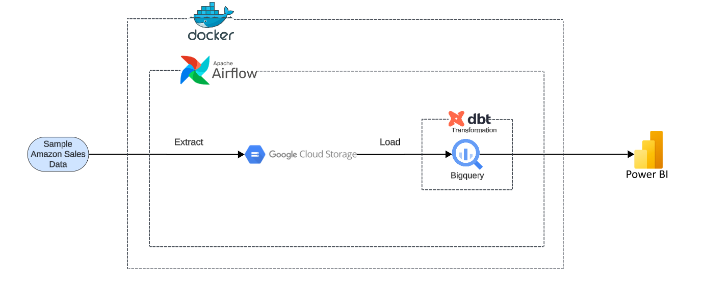
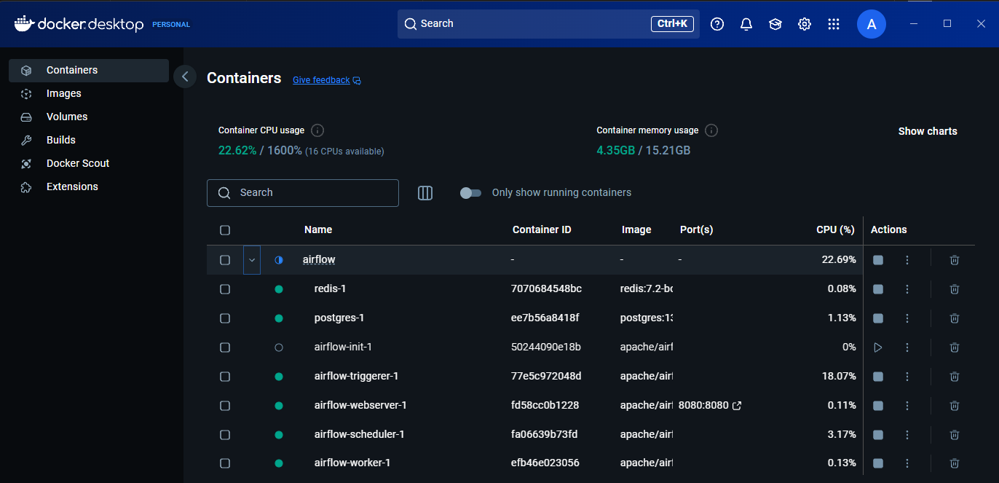
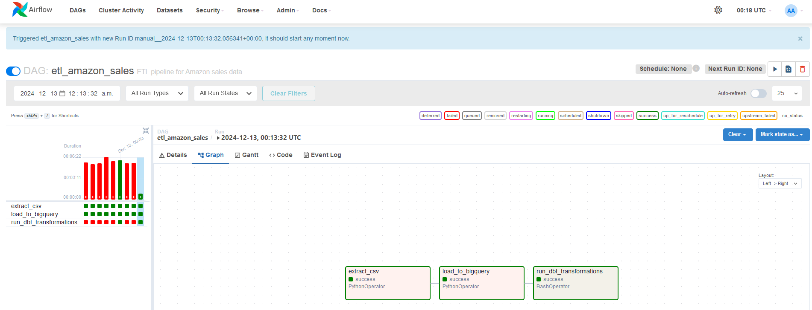
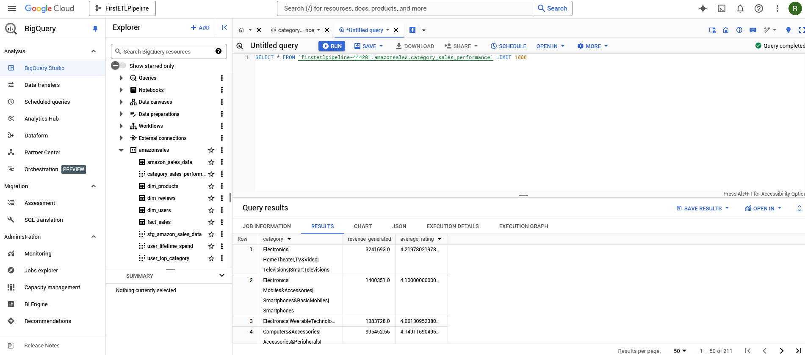
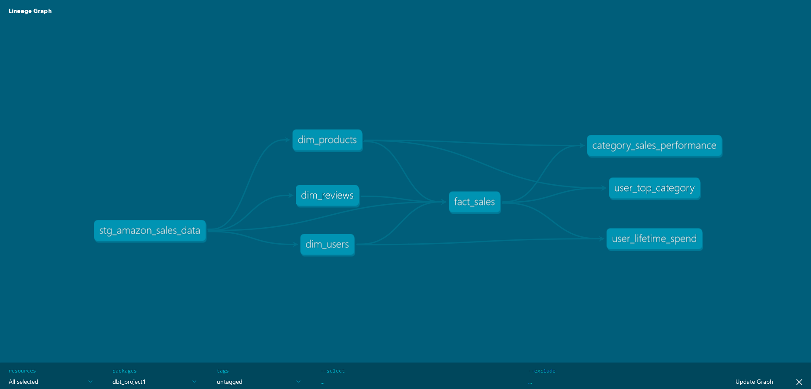
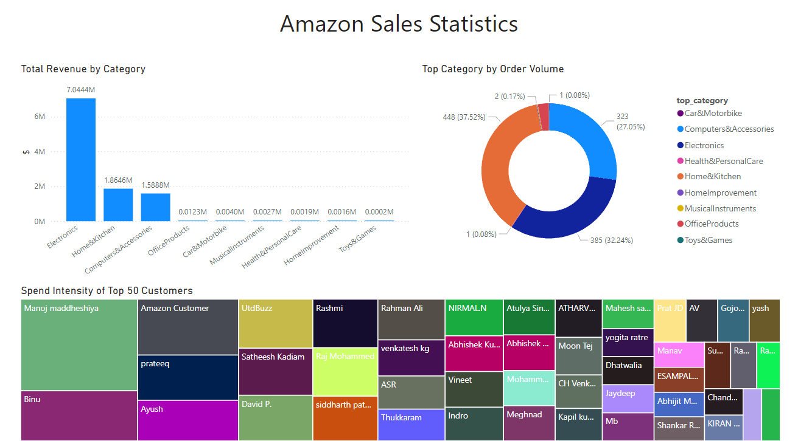

# amazon-elt-pipeline

- The purpose of this project is to learn how to use the following tools specifically: Docker, Apache Airflow, BigQuery, and DBT. 

- This project utilizes running Apache Airflow locally inside a Docker container. Airflow runs my data extraction task, loads it into BigQuery, and then runs my DBT transformations. The resulting views from my DBT transformations are then visualized in Power BI. The Power BI visuals are minimal as the focus of this project was to successfully build the data pipeline within Airflow. 

- Version control done within this GitHub repository using git add. git commit, and git push. While using .gitignore to leave out potentially sensitive data. 

- The raw data source was found on Kaggle, called "Amazon Sales Dataset EDA". 

Architecture Diagram

Dock Container

Airflow Graph

BigQuery

DBT Lineage Graph

Power BI Dashboard
